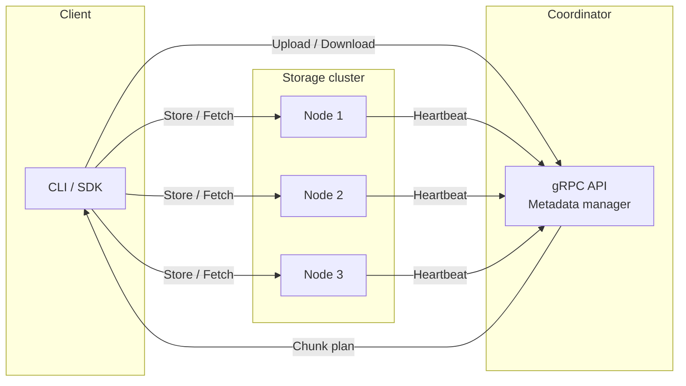

# Distributed File System (DFS) – Go implementation

A self-contained, **distributed file system written in Go**.  
It was built as a learning project to sharpen my skills around systems design, gRPC, and distributed systems.

## Why I wrote this

1. **Systems design practice** – implement real-world concerns such as chunk replication, leaderless coordination, and node resync.
2. **Production-style engineering** – clean logging, modular packages, Docker‐first deployment, GitHub Actions CI.

## High-level architecture



* **Coordinator** – stateless service that holds _metadata only_ (paths, chunk maps). It never stores file bytes.  
* **DataNode** – stores chunks on local disk, streams data via gRPC, and replicates to peers.  
* **Client** – CLI / SDK. Splits files, uploads chunks in parallel, confirms upload.

Replication is currently **N = 1 primary + 1 replica** but is configurable.

## Feature set (implemented)

• gRPC APIs generated via Protocol Buffers  
• Content-addressed chunking with SHA-256 checksums  
• Pluggable chunk storage (local disk today)  
• Heart-beat & node health tracking  
• Automatic re-replication on write  
• Integration test-bed with `docker-compose` spinning up 1 × Coordinator + 6 × DataNodes

## Roadmap

- [ ] Garbage cleaning
- [ ] File encryption
- [ ] TLS
- [ ] Access control & authentication  
- [ ] Gateway API
- [ ] Client CLI
- [ ] Observability - log streams

## Project layout

```text
cmd/            # Entrypoints (main.go for coordinator & datanode)
internal/       # Core libraries – clean Go modules, no external deps
pkg/proto/      # Generated protobuf & gRPC stubs
deploy/         # Dockerfiles, Compose, GitHub Action scripts
tests/          # Unit + integration tests (go test)
```

## Getting started locally

Prerequisites: Go 1.24+, Docker / Docker Compose.

Generating proto files:
```bash
make clean
make proto
```

Running integration tests:

```bash
make integration
```

Cleanup containers
```bash
make integration-down
```

## Continuous Integration

GitHub Actions workflow **`integration-tests.yml`** automatically:
1. Checks out the repo, sets up Go with caching.  
2. Builds and runs the full Compose environment in the cloud runner.  
3. Captures structured logs and uploads them as an artifact for post-run analysis.
---

*Author – [Victor Henzel Mochi]* 