# Distributed File System (DFS) – Go implementation

A self-contained, **distributed file system written in Go**.  
It was built as a learning project to sharpen my skills around systems design, gRPC, and distributed systems.

👉 **Read the detailed design document here → [docs/design.md](docs/design.md)**

## Why I wrote this

1. **Systems design practice** – implement real-world concerns such as chunk replication, leaderless coordination, and node resync.
2. **Production-style engineering** – clean logging, modular packages, Docker‐first deployment, GitHub Actions CI.

## High-level architecture

```mermaid
flowchart LR
    subgraph "Client"
        A["CLI / SDK"]
    end

    subgraph "Coordinator"
        C1["gRPC API<br/>Metadata manager"]
    end

    subgraph "Storage cluster"
        DN1["DataNode – primary"]
        DN2["DataNode – replica"]
    end

    A -- "Upload / Download" --> C1
    C1 -- "Chunk plan" --> A

    %% Client writes chunk to primary
    A -- "StoreChunk" --> DN1

    %% Primary replicates chunk via streaming gRPC
    DN1 -- "ReplicateChunk (stream)" --> DN2

    %% Reads can hit any replica
    A -- "RetrieveChunk" --> DN2

    %% Health-checks
    DN1 -- "Heartbeat" --> C1
    DN2 -- "Heartbeat" --> C1
```



* **Coordinator** – stateless service that holds _metadata only_ (paths, chunk maps). It never stores file bytes.  
* **DataNode** – stores chunks on local disk, streams data via gRPC, and replicates to peers.  
* **Client** – CLI / SDK. Splits files, uploads chunks in parallel, confirms upload.

Replication default is **factor 3 → 1 primary + 2 replicas** (constant `N_REPLICAS` in `datanode/server.go`) but it is fully configurable via environment or config file.

## Feature set (implemented)

• gRPC APIs generated via Protocol Buffers  
• Content-addressed chunking with SHA-256 checksums  
• Pluggable chunk storage (local disk today)  
• Heart-beat & node health tracking  
• Automatic re-replication on write  
• Integration test-bed with `docker-compose` spinning up 1 × Coordinator + 6 × DataNodes
• Shared `common.Streamer` abstraction – single implementation used by client uploads *and* DataNode-to-DataNode replication
• Extended integration-test matrix exercising multiple file sizes (1 MB → 1 GB) and chunk sizes (16 MB → 512 MB)

## Roadmap

- [ ] Garbage cleaning
- [ ] File encryption
- [ ] TLS
- [ ] Access control & authentication  
- [ ] Gateway API
- [ ] Client CLI
- [ ] Observability - log streams

## Project layout

```text
cmd/            # Entrypoints (main.go for coordinator & datanode)
internal/       # Core libraries – clean Go modules, no external deps
pkg/proto/      # Generated protobuf & gRPC stubs
deploy/         # Dockerfiles, Compose, GitHub Action scripts
tests/          # Unit + integration tests (go test)
```

## Getting started locally

Prerequisites: Go 1.24+, Docker / Docker Compose.

Generating proto files:
```bash
make clean
make proto
```

Running integration tests:

```bash
make integration
```

Cleanup containers
```bash
make integration-down
```

## Continuous Integration

GitHub Actions workflow **`integration-tests.yml`** automatically:
1. Checks out the repo, sets up Go with caching.  
2. Builds and runs the full Compose environment in the cloud runner.  
3. Captures structured logs and uploads them as an artifact for post-run analysis.

## Node-management internals

The **NodeManager** in the coordinator (and a read-only copy inside every DataNode) is the single source of truth for cluster membership and health.

Key mechanics:

* **Versioned updates** – every add / remove / status change bumps a monotonically increasing `currentVersion`.  The last *N* updates are kept in a circular buffer so DataNodes can request *only* the diff since their last known version.
* **Heartbeats** – DataNodes ping the coordinator every 30 s with their ID, disk-usage & health. The coordinator replies with:
  * `updates[]` – incremental changes since the node's `lastSeenVersion`, or
  * `requiresFullResync = true` if the node is too far behind.
* **Selector plug-in** – `NodeSelector` interface lets you swap placement strategy.  The default picks the first healthy nodes; you can inject capacity-aware or network-aware selectors easily.
* **Local caches** – DataNodes keep a local map so they can service reads without asking the coordinator; they apply the incremental updates lazily.

Primary write path:
1. Client asks coordinator for an upload plan.  
2. Coordinator fragments the file, chooses a primary + replica set per chunk, and returns `ChunkLocation{ChunkID, Node}` entries.
3. Client streams `StoreChunk` to the primary.  
4. Primary verifies checksum, persists chunk, then issues `ReplicateChunk` RPCs to its peers.  
5. Peers stream back `ChunkDataAck`; once enough replicas succeed, the primary reports success.

This design keeps metadata centralized while letting data flow peer-to-peer for better throughput.

* **Streaming replication with back-pressure** – once a replica accepts a `ReplicateChunk` request, the primary opens a bidirectional `ChunkDataStream`.  Each data message carries an `offset`, `isFinal` flag and checksum; the replica replies with `ChunkDataAck{bytesReceived, readyForNext}` enabling TCP-like flow control so a slow disk doesn't overwhelm memory on either side.
