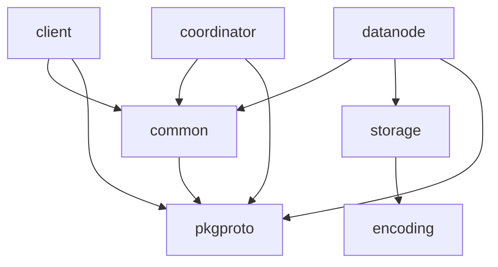

# Architecture

This document complements [`docs/design.md`](design.md) by focussing on the
responsibilities of every component and how they interact at runtime.

---

## Components

| Component | Responsibility | Key packages |
|-----------|----------------|--------------|
| **Coordinator** | • Maintain file-system metadata (path → chunk list).  \
  • Track DataNode membership & health via heart-beats.  \
  • Plan uploads / downloads. | `internal/coordinator` |
| **DataNode** | • Store chunk bytes on local disk.  \
  • Serve uploads & downloads via gRPC streams.  \
  • Replicate chunks to peer nodes. | `internal/datanode` + `internal/storage` |
| **Client SDK / CLI** | • Split files into chunks & compute checksums.  \
  • Drive upload/download flows.  \
  • Expose simple CLI for manual testing. | `internal/client` |
| **Streamer** | Zero-copy framing, retries and back-pressure for any
  `ChunkDataStream` (client → node or node → node). | `internal/common/streamer.go` |

---

## Coordinator endpoints

| RPC | Description |
|-----|-------------|
| `UploadFile(UploadRequest)` | Returns chunk plan (primary + replicas). |
| `ConfirmUpload(ConfirmUploadRequest)` | Commits metadata after client confirms all chunks uploaded. |
| `DownloadFile(DownloadRequest)` | Returns chunk map + file info. |
| `RegisterDataNode(RegisterDataNodeRequest)` | Called once at node start-up. |
| `DataNodeHeartbeat(HeartbeatRequest)` | Periodic health + disk usage update; returns incremental node updates. |

`internal/common/types.go` contains Go equivalents of most protobuf messages.

---

## DataNode gRPC surface

| RPC | Direction | Purpose |
|-----|-----------|---------|
| `PrepareChunkUpload` | unary | Ask a node if it can accept the chunk. |
| `UploadChunkStream` | bidi stream | Push chunk bytes (client → primary, primary → replica). |
| `PrepareChunkDownload` | unary | Validate chunk exists and create session. |
| `DownloadChunkStream` | server stream | Stream chunk bytes to client / peer. |
| `DeleteChunk` | unary | Remove a chunk. |
| `HealthCheck` | unary | Optional liveness probe. |

---

## Streaming protocol (ChunkDataStream)
Every message contains:

* `session_id` – UUID from the *Prepare* phase.
* `chunk_id` – unique per chunk.
* `offset` – byte offset of `data` relative to start of chunk.
* `is_final` – last frame flag.
* `partial_checksum` – SHA-256 of this frame (allows early detection).

The receiver responds with `ChunkDataAck{bytes_received, ready_for_next}` which
enables back-pressure: when the DataNode's buffer exceeds a threshold it can
set `ready_for_next=false` so the sender pauses.

---

## Failure handling

| Failure | Detection | Recovery |
|---------|-----------|----------|
| **Client disconnects** while primary is still replicating | Replica's `stream.Recv()` returns `Canceled`. | Primary aborts replication; client may retry the whole chunk. |
| **Replica timeout** | Primary waits `REPLICATE_TIMEOUT` per replica. | If replicas < required, primary returns error → client retry. |
| **Checksum mismatch** | Verified after stream closes. | Chunk is discarded; upload fails; client retry. |

---

## Build-time constants vs runtime config
Currently two values are compile-time constants:

* `N_REPLICAS` (default 3)
* `N_NODES` (used to pre-select candidates)

They live at the top of `internal/datanode/server.go`.  Making them runtime
configurable is tracked in [issue #56](https://github.com/mochivi/distributed-file-system/issues/56).

---

## Package dependency diagram

---

## Glossary
* **Chunk** – immutable byte sequence (~16–64 MiB) identified by ID `hash_index`.
* **Primary** – DataNode that first receives a chunk from the client.
* **Replica** – DataNode that receives the chunk from the primary.
* **Session** – Temporary state (checksum, buffer) keyed by `session_id` during a stream.