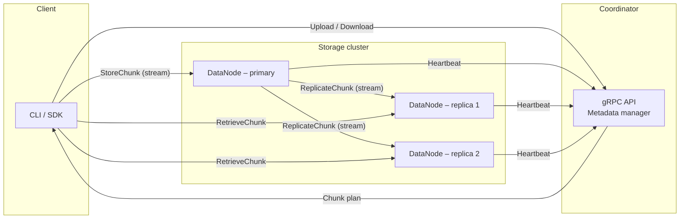
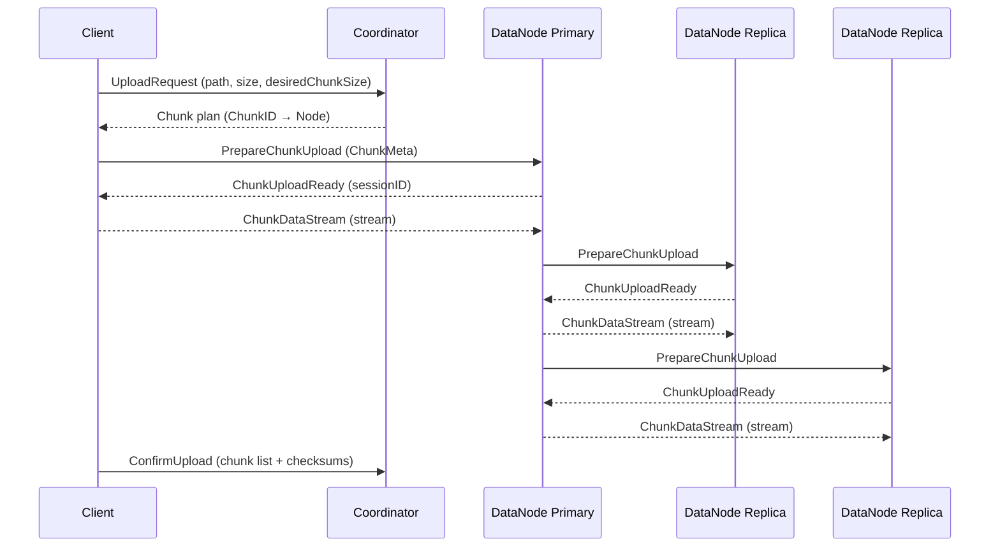

# Distributed File System (DFS) – Design Overview

## 1. High-level Architecture

### Component Responsibilities

* **Coordinator** – Stateless service that maintains metadata only: file paths, chunk-to-node mapping and cluster membership / health.  It never stores file bytes.
* **DataNode** – Stores chunk bytes on local disk, streams them via gRPC and replicates to sibling nodes.
* **Client SDK / CLI** – Splits files into chunks, orchestrates uploads/downloads in parallel, and confirms uploads.  
  All streaming logic (chunk framing, back-pressure, retries) is implemented once in a reusable component **`common.Streamer`** and reused by both the client and DataNode replication paths.

*Default replication factor today is 3 (1 primary + 2 replicas) but it is configurable via node and coordinator config.*

---

## 2. Data-flow – Upload (current implemented feature)

Steps in detail:

1. **UploadRequest** – Client sends path, size & optional chunk size to `Coordinator.UploadFile`.
2. **Chunk plan** – Coordinator shards the file logically and picks a *primary* and *n-1 replicas* for each chunk using the pluggable `NodeSelector`.
3. **PrepareChunkUpload** – Client sends `ChunkMeta` to the primary. Node answers `ChunkUploadReady(sessionID)` if it can accept the chunk.  
4. **ChunkDataStream** – Client opens a bidirectional stream (`ChunkDataStream`) identified by the session ID and pushes data via `common.Streamer` until `isFinal=true`.
5. **ReplicateChunk** – After persisting, the primary performs the same *prepare → stream* handshake with each replica. Back-pressure and framing are identical because it reuses `common.Streamer`.
6. **ConfirmUpload** – Once all chunks are safely stored and replicated, the client finalises the session so the coordinator commits metadata atomically.

---

## 3. Roadmap / Future Work

1. **Unit test coverage** across all packages.
2. **Additional integration tests**: Download, List, Delete, etc.
3. **Garbage collection** for orphaned chunks.
4. **Security** – TLS transport & optional at-rest encryption.
5. **Access control** – JWT or mTLS based authentication & authorisation.
6. **HTTP gateway** and richer CLI UX.
7. **Observability** – metrics, tracing and log streaming.
8. **Capacity-aware rebalancer** & erasure coding experiments.