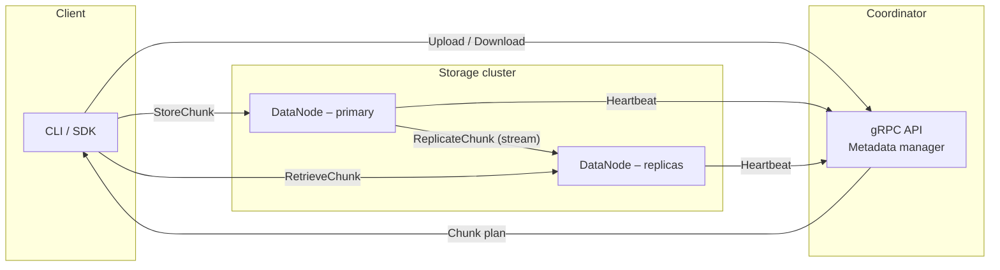
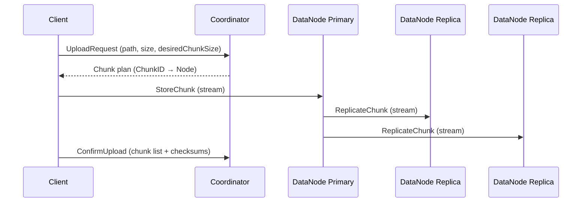

# Distributed File System (DFS) – Design Overview

## 1. High-level Architecture

### Component Responsibilities

* **Coordinator** – Stateless service that maintains metadata only: file paths, chunk-to-node mapping and cluster membership / health.  It never stores file bytes.
* **DataNode** – Stores chunk bytes on local disk, streams them via gRPC and replicates to sibling nodes.
* **Client SDK / CLI** – Splits files into chunks, orchestrates uploads/downloads in parallel, and confirms uploads.

---

## 2. Data-flow – Upload (current implemented feature)

Steps in detail:

1. **UploadRequest** – Client sends path, size & optional chunk size to `Coordinator.UploadFile`.
2. **Chunk plan** – Coordinator shards the file logically and picks a *primary* and *n-1 replicas* for each chunk using the pluggable `NodeSelector`.
3. **StoreChunk (stream)** – Client streams the chunk to the primary DataNode (`StoreChunk`). The node validates checksum and persists to disk.
4. **ReplicateChunk (stream)** – Primary opens parallel bidirectional streams to peer DataNodes. Each frame carries offset, checksum & `isFinal`. Peers ACK incrementally enabling back-pressure.
5. **ConfirmUpload** – Once all chunks are replicated, the client finalises the session so the coordinator can commit the metadata atomically.

---

## 3. Roadmap / Future Work

1. **Unit test coverage** across all packages.
2. **Additional integration tests**: Download, List, Delete, etc.
3. **Garbage collection** for orphaned chunks.
4. **Security** – TLS transport & optional at-rest encryption.
5. **Access control** – JWT or mTLS based authentication & authorisation.
6. **HTTP gateway** and richer CLI UX.
7. **Observability** – metrics, tracing and log streaming.
8. **Capacity-aware rebalancer** & erasure coding experiments.