# Distributed File System (DFS) – System Design

## Overview

This document outlines the comprehensive system design for the DFS project, covering both the current implementation and the planned architecture evolution. The design follows a microservices approach with clear separation of concerns and scalable components.

## Design Principles

- **Scalability**: Horizontal scaling through node addition
- **Reliability**: Data replication and fault tolerance
- **Security**: End-to-end encryption and RBAC
- **Observability**: Comprehensive monitoring and tracing
- **Modularity**: Pluggable components and interfaces

---

## Current Architecture

### Core Components

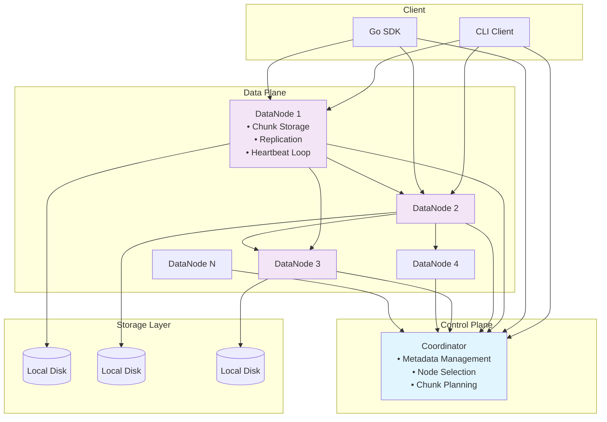

### Current Upload Data Flow

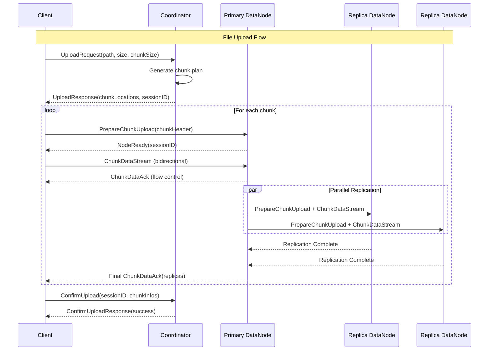

### Current Download Data Flow

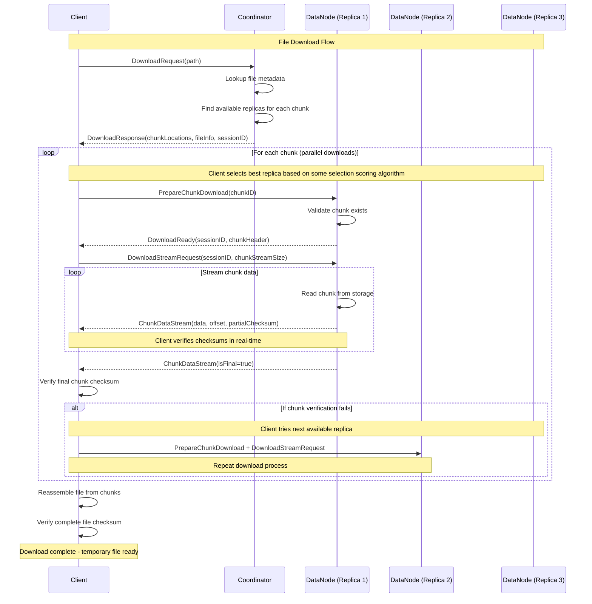

---

## Future Architecture

### Extended System Design

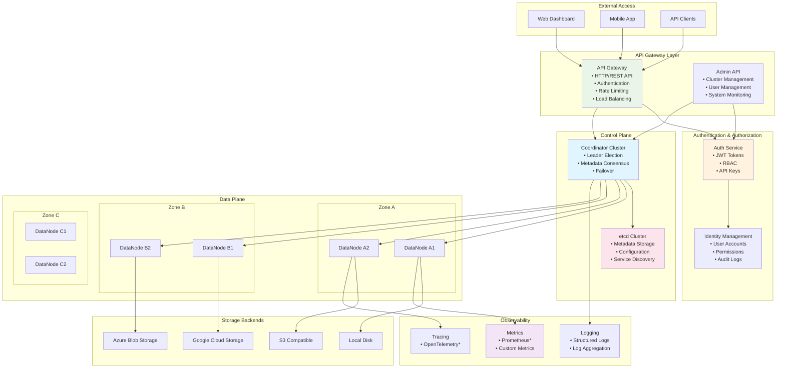

### API Gateway Design

The API Gateway serves as the single entry point for all external requests, providing:

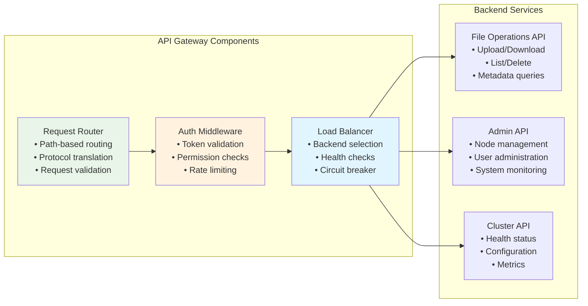

### Authentication & Authorization Flow

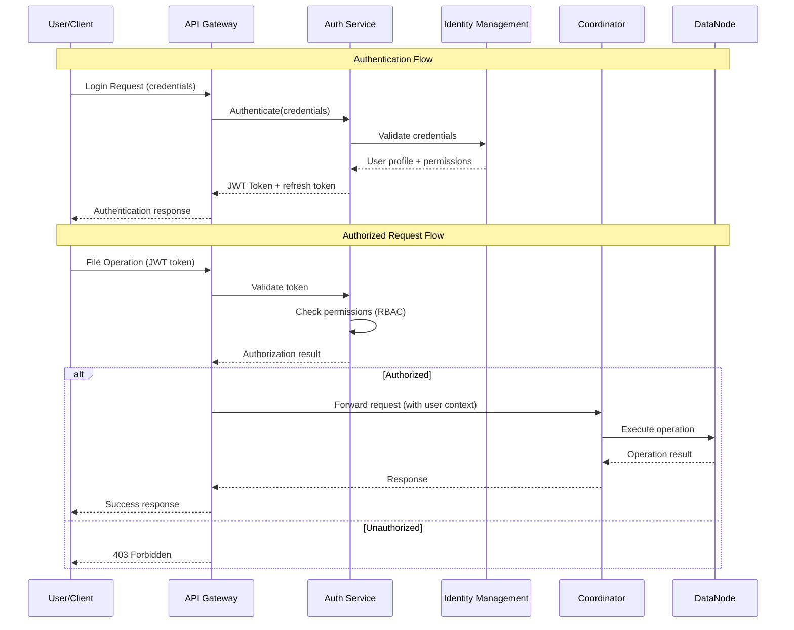

### Cluster Management API

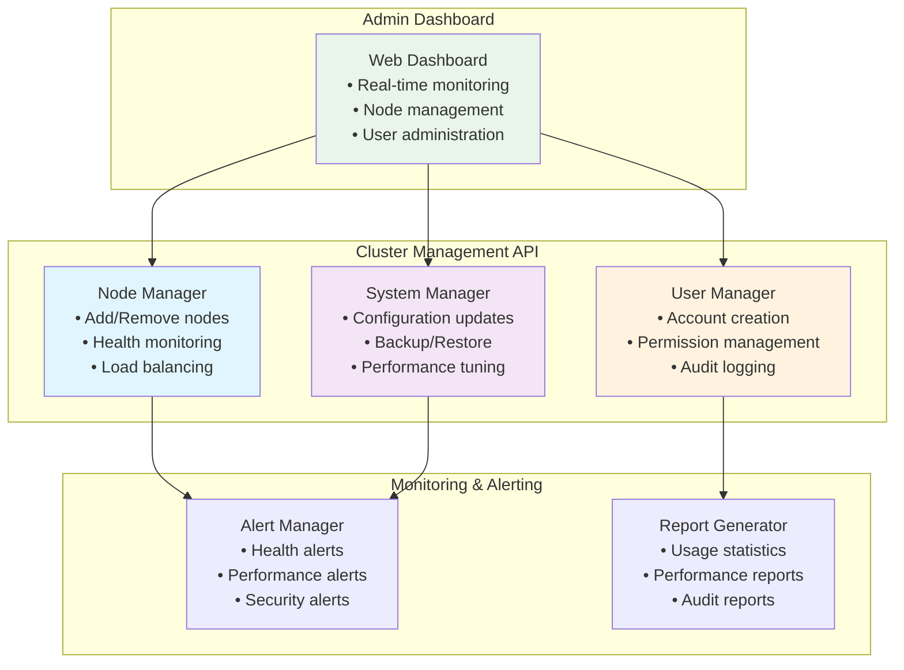

---

## Data Storage Design

### Metadata Architecture

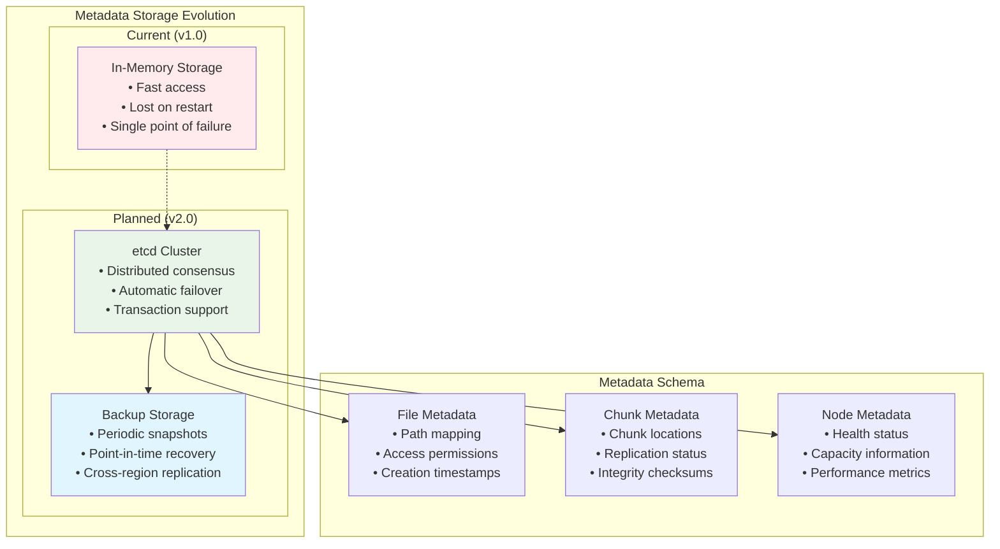

### Storage Backend Abstraction

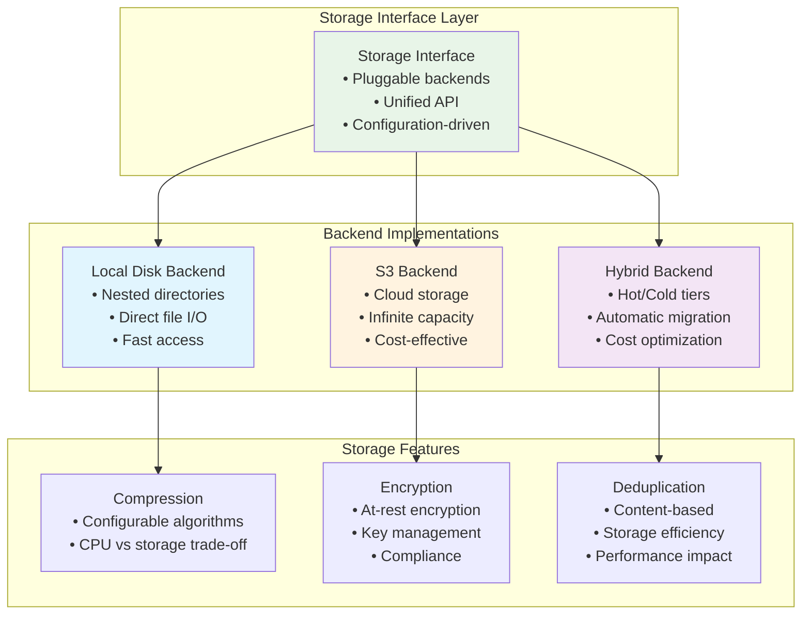

---

## Security Architecture

### Zero-Trust Security Model

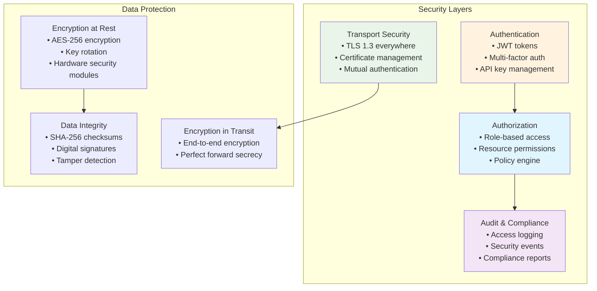

### Role-Based Access Control (RBAC)

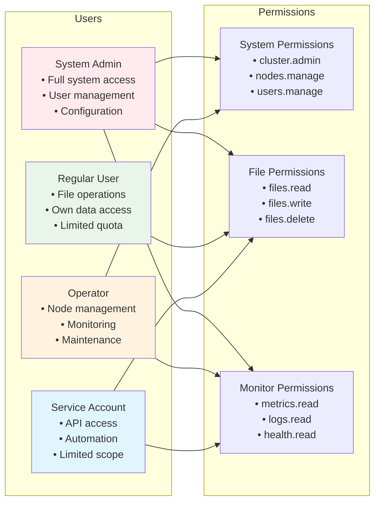

---

## Observability & Operations

### Monitoring Architecture

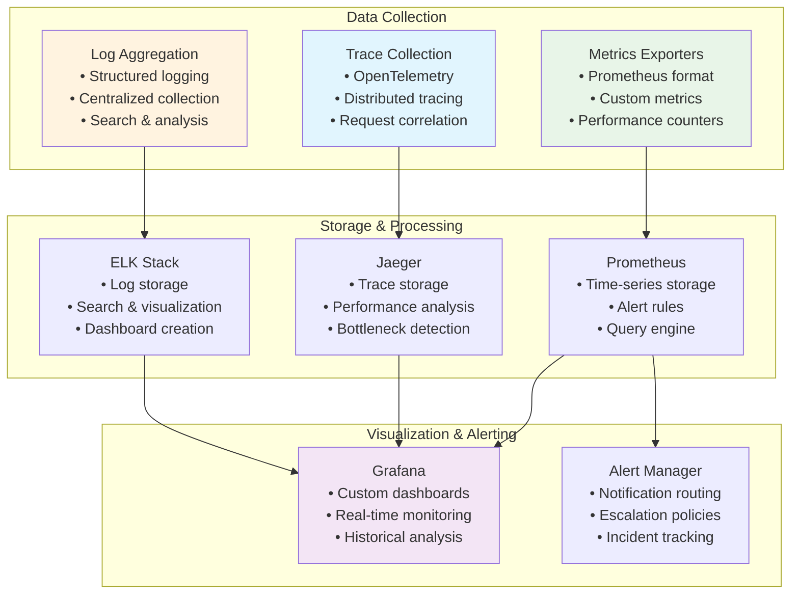

---

### Critical Design Decisions

1. **Metadata Storage**: Transition from in-memory to etcd cluster for persistence and consensus
2. **API Gateway**: Implement as separate, external service
3. **Authentication**: JWT RBAC
4. **Storage Backend**: Pluggable storage backend, must support local disk & cloud storage integration
5. **Monitoring**: Build custom vs. adopt existing observability stack (TDB)

---

## Conclusion

This design provides a comprehensive roadmap for evolving the DFS from a functional prototype to a production-ready distributed storage system. The architecture emphasizes modularity, security, and observability while maintaining the core simplicity that makes the system effective.

Key architectural principles:
- **Progressive enhancement**: Each phase builds upon previous foundations
- **Operational excellence**: Design for monitoring, debugging, and maintenance
- **Security by design**: Zero-trust model with defense in depth
- **Performance focus**: Optimize for both throughput and latency
- **Extensibility**: Plugin architecture for future enhancements

The design balances immediate functionality needs with long-term scalability requirements, ensuring the system can grow from a development prototype to an enterprise-grade storage solution.