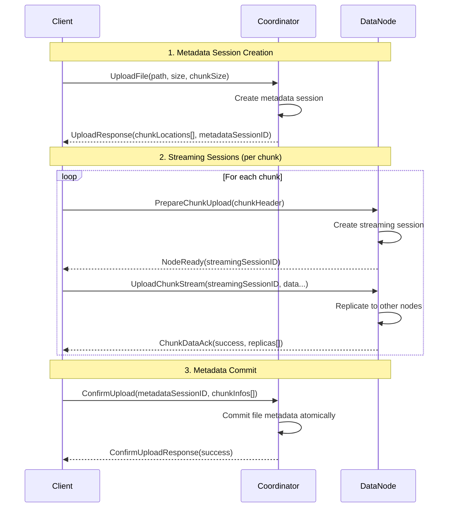

# Wire Protocol

DFS uses **Protocol Buffers** over **gRPC (HTTP/2)** for all service-to-service
communication. This document summarizes the key message types and RPCs. Full
IDL definitions are located in [`pkg/proto/*.proto`](../pkg/proto/).

---

## Core Messages

### Chunk-Related Messages
| Message | Purpose |
|---------|---------|
| `ChunkHeader` | Metadata for a chunk (`id`, `index`, `size`, `checksum`, `version`). |
| `ChunkInfo` | Complete chunk information including header and replica locations. |
| `ChunkDataStream` | Frame inside streaming protocol (data + offset + flags + checksum). |
| `ChunkDataAck` | Acknowledgement for a `ChunkDataStream` frame with flow control. |
| `ChunkLocation` | Mapping of chunk ID to available data nodes. |

### File Operation Messages
| Message | Purpose |
|---------|---------|
| `FileInfo` | Complete file metadata (path, size, chunks, timestamps, checksum). |
| `UploadRequest` | Client request to upload a file (path, size, desired chunk size). |
| `UploadResponse` | Coordinator response with chunk plan and metadata session ID. |
| `DownloadRequest` | Client request to download a file by path. |
| `DownloadResponse` | Coordinator response with chunk locations and file info. |
| `ConfirmUploadRequest` | Client confirmation of successful chunk uploads. |
| `ConfirmUploadResponse` | Coordinator acknowledgment of metadata commit. |

### Node Management Messages
| Message | Purpose |
|---------|---------|
| `NodeInfo` | Node metadata (ID, address, capacity, status, last seen). |
| `HealthStatus` | Node health information (status, timestamp). |
| `HeartbeatRequest` | Periodic node status update with version tracking. |
| `HeartbeatResponse` | Coordinator response with incremental cluster updates. |
| `NodeUpdate` | Incremental cluster state change (add/remove/update node). |

See `common.proto`, `coordinator.proto`, `datanode.proto` for complete field definitions.

---

## RPC Interface Matrix

### Coordinator Service
| RPC | Type | Purpose | Status |
|-----|------|---------|--------|
| `UploadFile` | unary | Plan upload, returns chunk locations and metadata session ID. | ✅ Implemented |
| `ConfirmUpload` | unary | Atomically commit file metadata after chunk uploads complete. | ✅ Implemented |
| `DownloadFile` | unary | Returns chunk map and file info for download. | ✅ Implemented |
| `DeleteFile` | unary | Remove file metadata and trigger chunk cleanup. | 🚧 API Defined |
| `ListFiles` | unary | List files in directory with pagination support. | 🚧 API Defined |
| `RegisterDataNode` | unary | Node joins cluster and receives initial state. | ✅ Implemented |
| `DataNodeHeartbeat` | unary | Periodic health updates with incremental cluster state. | ✅ Implemented |
| `ListNodes` | unary | Query current cluster membership and status. | ✅ Implemented |

### DataNode Service
| RPC | Type | Purpose | Status |
|-----|------|---------|--------|
| `PrepareChunkUpload` | unary | Capacity check and session creation; returns streaming session ID. | ✅ Implemented |
| `UploadChunkStream` | bidi stream | Push chunk bytes with replication (client → primary, primary → replicas). | ✅ Implemented |
| `PrepareChunkDownload` | unary | Validate chunk exists and create download session. | ✅ Implemented |
| `DownloadChunkStream` | server stream | Stream chunk bytes to client. | ✅ Implemented |
| `DeleteChunk` | unary | Remove chunk from storage (called during file deletion). | ✅ Implemented |
| `HealthCheck` | unary | Liveness probe for monitoring and load balancers. | ✅ Implemented |

---

## Session Management Protocol

The system uses two distinct session types for different operational scopes:

### Streaming Sessions (DataNode)
- **Purpose:** Manage individual chunk transfer streams
- **Lifecycle:** Prepare → Stream → Complete/Timeout
- **Session ID:** UUID generated during `PrepareChunkUpload/Download`
- **Scope:** Single chunk operation between client and node
- **Timeout:** Configurable per-node (default: 1 minute idle)

### Metadata Sessions (Coordinator)
- **Purpose:** Ensure atomicity of file operations
- **Lifecycle:** UploadFile → ChunkUploads → ConfirmUpload
- **Session ID:** UUID generated during `UploadFile`
- **Scope:** Complete file operation across multiple chunks
- **Timeout:** Configurable per-coordinator (default: 5 minutes)

---

## Upload Session Lifecycle



### Session Lifecycle Steps

1. **Metadata Session Creation**: Coordinator creates session for entire file operation
2. **Streaming Sessions**: DataNode creates session for each chunk transfer
3. **Chunk Upload**: Client streams data with replication managed by primary node
4. **Metadata Commit**: Client confirms all chunks uploaded; coordinator commits atomically
5. **Session Cleanup**: Both session types cleaned up after completion or timeout

---

## Streaming Protocol Details

### ChunkDataStream Message Structure
```protobuf
message ChunkDataStream {
  string session_id = 1;        // Streaming session UUID
  string chunk_id = 2;          // Unique chunk identifier
  bytes data = 3;               // Actual file data (up to 256KB per frame)
  int64 offset = 4;             // Byte offset within chunk
  bool is_final = 5;            // Last frame in chunk
  string partial_checksum = 6;  // SHA-256 of this frame
}
```

### ChunkDataAck Response Structure
```protobuf
message ChunkDataAck {
  string session_id = 1;              // Echo of streaming session UUID
  bool success = 2;                   // Frame processing status
  string message = 3;                 // Error message if success=false
  int64 bytes_received = 4;           // Total bytes received so far
  bool ready_for_next = 5;            // Flow control signal
  repeated DataNodeInfo replicas = 6; // Final ack includes replica status
}
```

### Flow Control Protocol (TODO: implement buffer flushing to disk)
- **Back-pressure**: DataNode sets `ready_for_next=false` when buffer full
- **Client behavior**: Waits for `ready_for_next=true` before sending next frame
- **Timeout handling**: Streams timeout if no activity within session timeout
- **Error recovery**: Checksum mismatches trigger chunk retry at client level

---

## Replication Protocol

Replication is handled transparently within the `UploadChunkStream` RPC:

1. **Client** uploads to **Primary DataNode**
2. **Primary** simultaneously replicates to **Replica DataNodes**
3. **Primary** waits for replica confirmations (with configurable timeout)
4. **Primary** sends final `ChunkDataAck` with replica status to client
5. **Client** includes replica information in `ConfirmUpload` to coordinator

### Replication Failure Handling
- **Insufficient replicas**: Primary returns error; client retries entire chunk
- **Replica timeout**: Configurable per-node timeout for replica operations  
- **Network partition**: Primary continues if minimum replicas achieved
- **Checksum verification**: All nodes verify checksums independently

---

## Error Handling and Recovery

### Client-Side Errors
| Error | Cause | Recovery |
|-------|-------|----------|
| `SESSION_NOT_FOUND` | Invalid or expired session ID | Restart operation from prepare phase |
| `CHECKSUM_MISMATCH` | Data corruption during transfer | Retry chunk upload |
| `INSUFFICIENT_REPLICAS` | Not enough nodes available | Retry with backoff or fail |
| `TIMEOUT` | Session or operation timeout | Retry operation with new session |

### Server-Side Errors
| Error | Cause | Recovery |
|-------|-------|----------|
| `CAPACITY_EXCEEDED` | Node storage full | Select different node |
| `CHUNK_NOT_FOUND` | Missing chunk during download | Try alternative replica |
| `INVALID_REQUEST` | Malformed request | Fix client request format |
| `INTERNAL_ERROR` | Server-side failure | Retry with different node |

---

## Protocol Versioning and Compatibility

### Forward Compatibility
- **Field additions**: Safe - proto3 handles unknown fields gracefully
- **Optional fields**: Can be added without breaking existing clients
- **New RPCs**: Can be added to services without affecting existing clients

### Breaking Changes  
- **Required field changes**: Not allowed - breaks wire compatibility
- **Tag number changes**: Never allowed - corrupts wire format
- **Message removal**: Requires deprecation period and version coordination

### Version Management
- Protocol buffer compiler version pinned in `go.mod`
- Generated code checked into repository for reproducible builds
- API versioning planned for future major protocol changes

---

## Performance Characteristics

### Streaming Performance
- **Frame size**: 256KB default (configurable)
- **Concurrent streams**: Limited per node to prevent resource exhaustion
- **Compression**: gRPC-level compression available (configurable)
- **Connection reuse**: gRPC connection pooling for efficiency

### Protocol Overhead
- **Message framing**: ~50 bytes per ChunkDataStream frame
- **Session management**: ~200 bytes per session creation
- **Heartbeat frequency**: 30 seconds default (configurable)
- **Metadata operations**: Sub-millisecond for in-memory coordinator

---

## Security Considerations

### Transport Security
- **TLS**: Required for all gRPC connections in production
- **Certificate validation**: Mutual TLS authentication planned
- **Network isolation**: Services should run in protected network segments

### Data Integrity
- **Checksums**: SHA-256 at frame, chunk, and file levels
- **Verification**: Multiple verification points throughout pipeline
- **Tamper detection**: Checksum mismatches trigger immediate failure

### Authentication
- **Service authentication**: mTLS between internal services (planned)
- **Client authentication**: JWT tokens via API gateway (planned)  
- **Authorization**: RBAC for file and cluster operations (planned)
