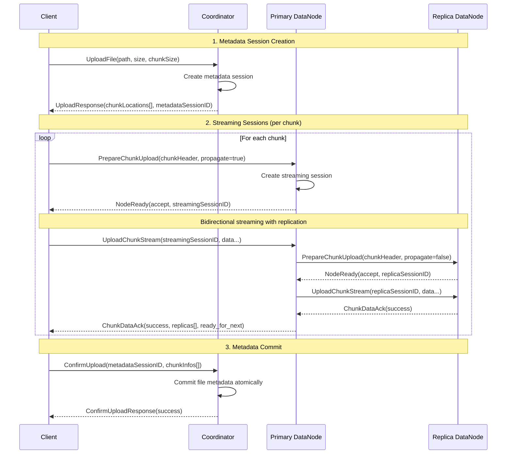
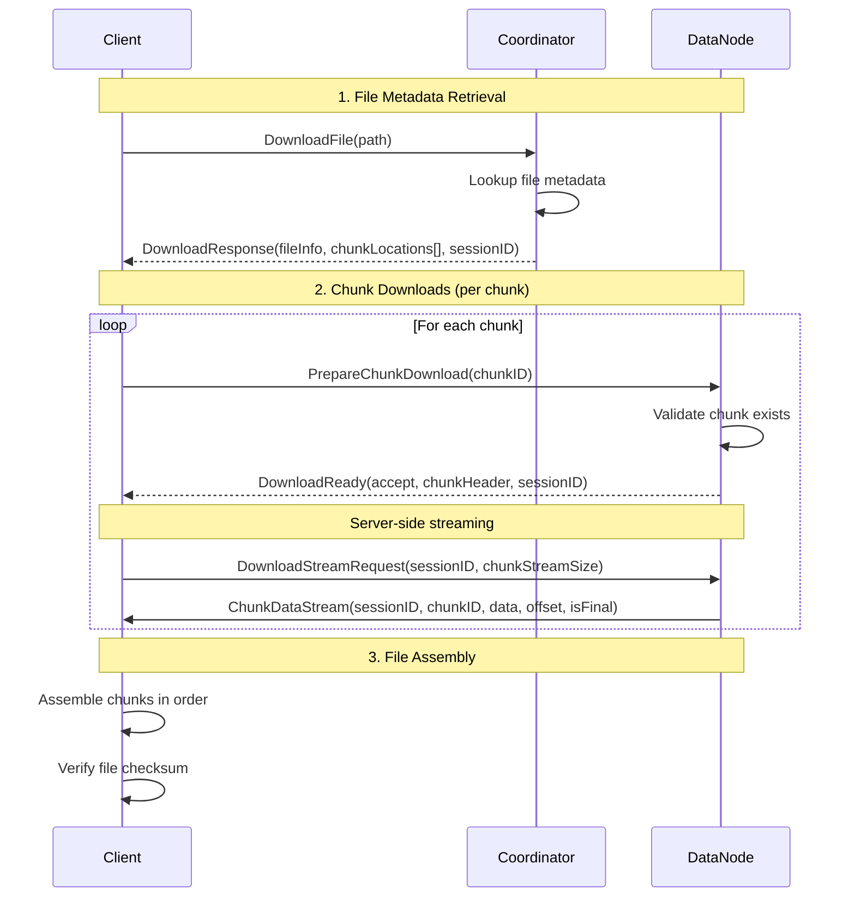
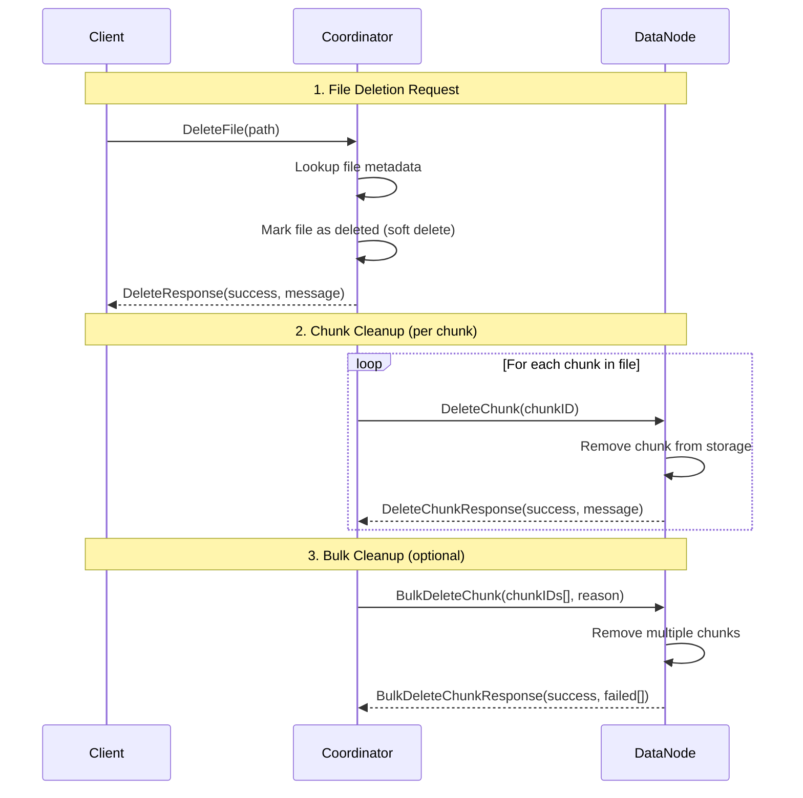

# Wire Protocol

DFS uses **Protocol Buffers** over **gRPC (HTTP/2)** for all service-to-service
communication. This document summarizes the key message types and RPCs. Full
IDL definitions are located in [`pkg/proto/*.proto`](../pkg/proto/).

---

## Core Messages

>Internal translation datatypes can be seen in the `internal/common` package

### Chunk-Related Messages
| Message | Purpose |
|---------|---------|
| `ChunkHeader` | Metadata for a chunk (`id`, `index`, `size`, `checksum`, `version`). |
| `ChunkInfo` | Complete chunk information including header and replica locations. |
| `ChunkDataStream` | Frame inside streaming protocol (data + offset + flags + checksum). |
| `ChunkDataAck` | Acknowledgement for a `ChunkDataStream` frame with flow control. |
| `ChunkLocation` | Mapping of chunk ID to available data nodes. |
| `NodeReady` | Signals whether a node is ready to start streaming a chunk (accept flag, session ID, optional message). |
| `DownloadReady` | Combines `NodeReady` with a `ChunkHeader` for download sessions. |
| `DownloadStreamRequest` | Client request parameters for a chunk download stream (session ID, frame size). |
| `DeleteChunkRequest` | Request to remove a specific chunk by ID. |
| `DeleteChunkResponse` | Result of deleting a chunk, including success flag and message. |
| `BulkDeleteChunkRequest` | Request to delete multiple chunks with a reason. |
| `BulkDeleteChunkResponse` | Result of a bulk delete operation including failed chunk list. |

### File Operation Messages
| Message | Purpose |
|---------|---------|
| `FileInfo` | Complete file metadata (path, size, chunks, timestamps, checksum). |
| `UploadRequest` | Client request to upload a file (path, size, desired chunk size). |
| `UploadResponse` | Coordinator response with chunk plan and metadata session ID. |
| `DownloadRequest` | Client request to download a file by path. |
| `DownloadResponse` | Coordinator response with chunk locations and file info. |
| `ConfirmUploadRequest` | Client confirmation of successful chunk uploads. |
| `ConfirmUploadResponse` | Coordinator acknowledgment of metadata commit. |

### Node Management Messages
| Message | Purpose |
|---------|---------|
| `NodeInfo` | Node metadata (ID, address, capacity, status, last seen). |
| `HealthStatus` | Node health information (status, timestamp). |
| `HeartbeatRequest` | Periodic node status update with version tracking. |
| `HeartbeatResponse` | Coordinator response with incremental cluster updates. |
| `NodeUpdate` | Incremental cluster state change (add/remove/update node). |
| `HealthCheckRequest` | Liveness probe for a single node. |
| `HealthCheckResponse` | Health status returned for a liveness probe. |

See `common.proto`, `coordinator.proto`, `datanode.proto` for complete field definitions.

---

## RPC Interface Matrix

### Coordinator Service
| RPC | Type | Purpose | Status |
|-----|------|---------|--------|
| `UploadFile` | unary | Plan upload, returns chunk locations and metadata session ID. | ✅ Implemented |
| `ConfirmUpload` | unary | Atomically commit file metadata after chunk uploads complete. | ✅ Implemented |
| `DownloadFile` | unary | Returns chunk map and file info for download. | ✅ Implemented |
| `DeleteFile` | unary | Remove file metadata and trigger chunk cleanup. | 🚧 API Defined |
| `ListFiles` | unary | List files in directory with pagination support. | 🚧 API Defined |
| `RegisterDataNode` | unary | Node joins cluster and receives initial state. | ✅ Implemented |
| `DataNodeHeartbeat` | unary | Periodic health updates with incremental cluster state. | ✅ Implemented |
| `ListNodes` | unary | Query current cluster membership and status. | ✅ Implemented |

### DataNode Service
| RPC | Type | Purpose | Status |
|-----|------|---------|--------|
| `PrepareChunkUpload` | unary | Capacity check and session creation; returns streaming session ID. | ✅ Implemented |
| `UploadChunkStream` | bidi stream | Push chunk bytes with replication (client → primary, primary → replicas). | ✅ Implemented |
| `PrepareChunkDownload` | unary | Validate chunk exists and create download session. | ✅ Implemented |
| `DownloadChunkStream` | server stream | Stream chunk bytes to client. | ✅ Implemented |
| `DeleteChunk` | unary | Remove chunk from storage (called during file deletion). | ✅ Implemented |
| `BulkDeleteChunk` | unary | Delete multiple chunks in one request (garbage collection, rebalance). | ✅ Implemented |
| `HealthCheck` | unary | Liveness probe for monitoring and load balancers. | ✅ Implemented |

---

## Session Management Protocol

The system uses two distinct session types for different operational scopes:

### Streaming Sessions (DataNode)
- **Purpose:** Manage individual chunk transfer streams
- **Lifecycle:** Prepare → Stream → Complete/Timeout
- **Session ID:** UUID generated during `PrepareChunkUpload/Download`
- **Scope:** Single chunk operation between client and node
- **Timeout:** Configurable per-node (default: 1 minute idle)

### Metadata Sessions (Coordinator)
- **Purpose:** Ensure atomicity of file operations
- **Lifecycle:** UploadFile → ChunkUploads → ConfirmUpload
- **Session ID:** UUID generated during `UploadFile`
- **Scope:** Complete file operation across multiple chunks
- **Timeout:** Configurable per-coordinator

---

## Upload Session Lifecycle



### Upload Session Lifecycle Steps

1. **Metadata Session Creation**: Coordinator creates session for entire file operation
2. **Streaming Sessions**: DataNode creates session for each chunk transfer
3. **Chunk Upload**: Client streams data with replication managed by primary node
4. **Metadata Commit**: Client confirms all chunks uploaded; coordinator commits atomically
5. **Session Cleanup**: Both session types cleaned up after completion or timeout

---

## Download Session Lifecycle



### Download Session Lifecycle Steps

1. **File Metadata Retrieval**: Coordinator provides file info and chunk locations
2. **Chunk Downloads**: Client downloads each chunk from available DataNodes
3. **File Assembly**: Client assembles chunks and verifies integrity

---

## Delete Session Lifecycle



### Delete Session Lifecycle Steps

1. **File Deletion Request**: Coordinator marks file as deleted and returns success
2. **Chunk Cleanup**: Coordinator deletes each chunk from all replica nodes
3. **Bulk Cleanup**: Optional bulk deletion for garbage collection or rebalancing

> Note: for datanodes that were down/failed to receive during the chunk cleanup phase innitiated by the coordinator, the Orphaned Chunks Garbage Collector constantly scans the datanode's inventory locally, pulls the metadata from storage and cleans up leftover chunks. 

---

## Streaming Protocol Details

### ChunkDataStream Message Structure
```protobuf
message ChunkDataStream {
  string session_id = 1;        // Streaming session UUID
  string chunk_id = 2;          // Unique chunk identifier
  bytes data = 3;               // Actual file data (up to 256KB per frame)
  int64 offset = 4;             // Byte offset within chunk
  bool is_final = 5;            // Last frame in chunk
  string partial_checksum = 6;  // SHA-256 of this frame
}
```

### ChunkDataAck Response Structure
```protobuf
message ChunkDataAck {
  string session_id = 1;              // Echo of streaming session UUID
  bool success = 2;                   // Frame processing status
  string message = 3;                 // Error message if success=false
  int64 bytes_received = 4;           // Total bytes received so far
  bool ready_for_next = 5;            // Flow control signal
  repeated DataNodeInfo replicas = 6; // Final ack includes replica status
}
```

### Flow Control Protocol (TODO: implement buffer flushing to disk, currently, buffer is sized the same as the chunk)
- **Back-pressure**: DataNode sets `ready_for_next=false` when buffer full
- **Client behavior**: Waits for `ready_for_next=true` before sending next frame
- **Timeout handling**: Streams timeout if no activity within session timeout
- **Error recovery**: Checksum mismatches trigger chunk retry at client level

---

## Replication Protocol

Replication is handled transparently within the `UploadChunkStream` RPC:

1. **Client** uploads to **Primary DataNode**
2. **Primary** simultaneously replicates to **Replica DataNodes**
3. **Primary** waits for replica confirmations (with configurable timeout)
4. **Primary** sends final `ChunkDataAck` with replica status to client
5. **Client** includes replica information in `ConfirmUpload` to coordinator

### Replication Failure Handling
- **Insufficient replicas**: Primary returns error; client retries entire chunk
- **Replica timeout**: Configurable per-node timeout for replica operations  
- **Network partition**: Primary continues if minimum replicas achieved
- **Checksum verification**: All nodes verify checksums independently

---

## Error Handling and Recovery

The protocol uses a layered error-handling strategy:

- Service layer returns business outcomes (success and message) via response fields on RPCs that define them.
- Transport layer maps well-known sentinel errors to specific responses or gRPC status codes.
- The error interceptor `dfs/internal/grpcutil/interceptors.go` allows for translation of structured application errors.
- The error interceptor also defaults unknown errors to internal server error kinds.

#### Layers and flow

- Service (business logic): Prefer returning domain results using `success` and `message` fields when the RPC response supports it (e.g., `ConfirmUploadResponse`, `DeleteResponse`, `RegisterDataNodeResponse`, `HeartbeatResponse`).
- Transport (server handlers): Handle sentinel errors explicitly and either:
  - Convert to a structured response (e.g., heartbeat requires full resync), or
  - Convert to a gRPC status using app errors (e.g., NotFound).
- Interceptor: Converts `AppError` or `AppErrorTranslator` to gRPC status; otherwise returns `Internal`.

Examples:

```go
// dfs/internal/coordinator/server.go
resp, err := c.service.uploadFile(ctx, req)
if err != nil {
	if errors.Is(err, state.ErrNoAvailableNodes) {
		return nil, apperr.Wrap(codes.NotFound, "no available nodes", err)
	}
	return nil, err
}
```

```go
// dfs/internal/coordinator/server.go
if errors.Is(err, metadata.ErrNotFound) {
	return nil, apperr.Wrap(codes.NotFound, "file not found in metadata store", err)
}
if errors.Is(err, state.ErrNoAvailableNodes) {
	return nil, apperr.Wrap(codes.NotFound, "no available nodes", err)
}
```

```go
// dfs/internal/coordinator/server.go
if errors.Is(err, state.ErrNotFound) {
	return common.HeartbeatResponse{Success: false, Message: "node is not registered"}.ToProto(), nil
}
if errors.Is(err, state.ErrVersionTooOld) {
	return &proto.HeartbeatResponse{Success: true, Message: "version too old", RequiresFullResync: true}, nil
}
```

```go
// dfs/internal/grpcutil/interceptors.go
// ErrorsInterceptor translates errors to gRPC status.
if errTranslator, ok := err.(apperr.AppErrorTranslator); ok {
	appErr := errTranslator.ToAppError()
	return nil, status.Error(appErr.Code, appErr.Message)
}
if errors.As(err, &appErr) {
	return nil, status.Error(appErr.Code, appErr.Message)
}
return nil, status.Error(codes.Internal, "an unexpected internal error occurred")
```

#### Sentinel errors (handled in transport)

- state.ErrNoAvailableNodes: mapped to `NotFound` (e.g., `UploadFile`, `DownloadFile`).
- metadata.ErrNotFound: mapped to `NotFound` (e.g., `DownloadFile`, `DeleteFile`).
- state.ErrNotFound: for heartbeats, returned as a successful RPC with `success=false, message="node is not registered"`.
- state.ErrVersionTooOld: for heartbeats, returned as a successful RPC with `requires_full_resync=true`.

#### Service-layer business errors

For RPCs with `success`/`message` fields, service methods should encode business outcomes without surfacing transport errors. Examples:
- `ConfirmUpload`: return `success=false` with a user-facing message on validation failures.
- `DeleteFile`: return a structured `DeleteResponse`; only escalate to errors for transport-level or unexpected failures.

#### Unexpected or opaque errors

- Use `apperr.Wrap(...)` for known mappings; otherwise return the original error.
- The interceptor converts `AppError` or `AppErrorTranslator` into proper gRPC statuses.
- Any other error becomes a generic `Internal` error to the client, with details hidden.

Guidelines:
- Prefer structured responses (success/message) where proto supports it. Use it for business logic errors.
- Use sentinel errors for cross-layer control flow and handle them in the server handlers (transport e.g `server.go` files).
- Use `AppError` for explicit status mapping; let the interceptor translate.
- Avoid leaking internal error details; rely on the interceptor for generic internal failures.

---

## Performance Characteristics

### Streaming Performance
- **Frame size**: 256KB default (configurable)
- **Concurrent streams**: Limited per node to prevent resource exhaustion
- **Compression**: gRPC-level compression available
- **Connection reuse**: gRPC connection pooling for efficiency

### Protocol Overhead
- **Message framing**: TODO: calculate message size in bytes
- **Heartbeat frequency**: 30 seconds default (configurable); TODO: calculate average message sizes

> Benchmarks to be added in future update

---

## Security Considerations

### Transport Security
- **TLS**: Required for all gRPC connections in production
- **Certificate validation**: Mutual TLS authentication planned
- **Network isolation**: Services should run in protected network segments

### Data Integrity
- **Checksums**: SHA-256 at chunk and file levels. TODO: per-frame checksum - requires benchmark, would allow for frame retries (validate if needed). 
- **Verification**: Multiple verification points throughout pipeline
- **Tamper detection**: Checksum mismatches trigger immediate failure

### Authentication
- **Service authentication**: mTLS between internal services (planned)
- **Client authentication**: JWT tokens via API gateway (planned)  
- **Authorization**: RBAC for file and cluster operations (planned)
